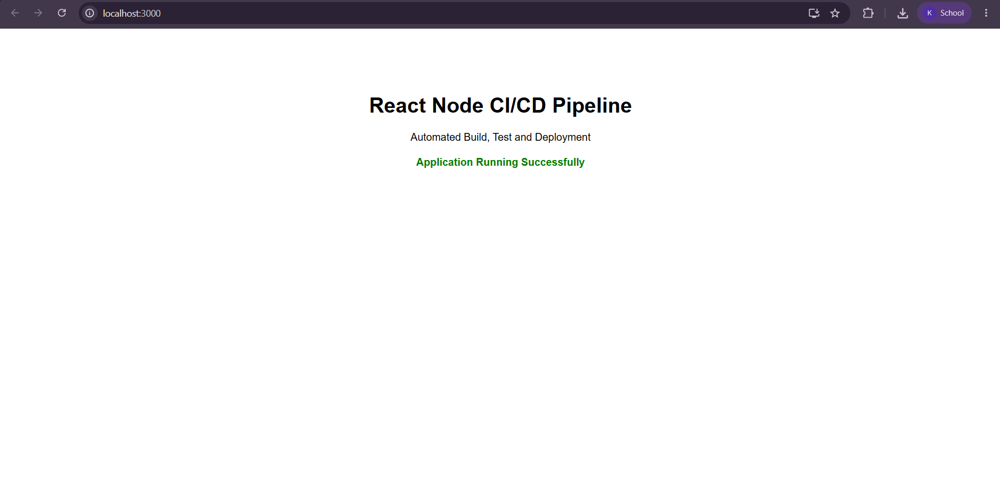
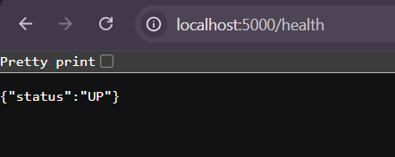
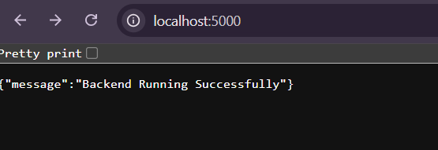

# React–Node.js CI/CD Pipeline

## Project Overview

This project demonstrates a complete Continuous Integration and Continuous Deployment (CI/CD) pipeline for a React frontend and Node.js backend application.

The pipeline automates:

- Source Code Management using GitHub
- Continuous Integration using GitHub Actions
- Automated Testing
- Docker Image Creation
- Continuous Deployment using Docker

---

## Technology Stack

| Component | Technology |
|------------|------------|
| Frontend | React.js |
| Backend | Node.js + Express |
| Version Control | Git |
| Repository | GitHub |
| CI/CD | GitHub Actions |
| Containerization | Docker |
| Deployment | Docker Compose |

---

## Project Structure

```text
react-node-cicd
│
├── client
├── server
├── .github
│   └── workflows
│       └── ci-cd.yml
│
├── images
│
├── docker-compose.yml
└── README.md
```

---

## CI/CD Workflow

1. Developer pushes code to GitHub
2. GitHub Actions starts automatically
3. Dependencies are installed
4. Unit tests are executed
5. React application is built
6. Docker images are generated
7. Images are deployed

---

## GitHub Frontend



---

## Docker Backend




---

## Running the Project Locally

### Backend

```bash
cd server
npm install
node server.js
```

Backend:

```text
http://localhost:5000
```

---

### Frontend

```bash
cd client
npm install
npm start
```

Frontend:

```text
http://localhost:3000
```

---

### Docker Deployment

```bash
docker compose build
docker compose up
```

---

## API Endpoints

### Home Endpoint

```http
GET /
```

Response:

```json
{
  "message": "Backend Running Successfully"
}
```

### Health Check

```http
GET /health
```

Response:

```json
{
  "status": "UP"
}
```

---

## CI/CD Pipeline Stages

```text
GitHub Push
     ↓
GitHub Actions
     ↓
Install Dependencies
     ↓
Run Tests
     ↓
Build React App
     ↓
Build Docker Images
     ↓
Deploy Application
```

---

## Author

Krisha Ebrahimpurkar

DevOps | AI & Data Science Student